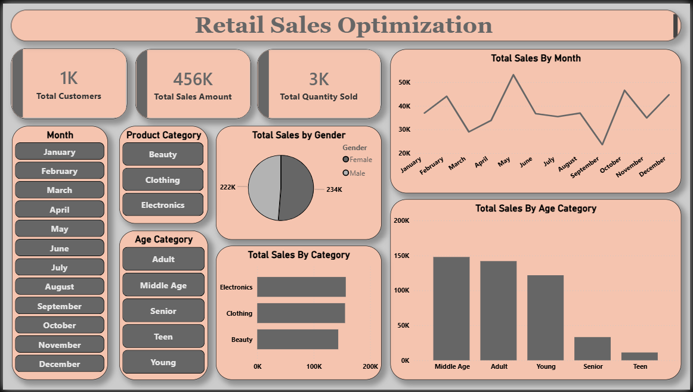

# 📊 Retail Sales Optimization

## 🚀 Project Overview

Retail businesses generate large volumes of sales data every day. The objective of this project was to analyze retail sales transactions, identify customer purchasing patterns, evaluate product performance, and generate actionable business insights to improve sales performance and business decision-making.

This project demonstrates an end-to-end Data Analytics workflow, including **Data Cleaning, Exploratory Data Analysis (EDA), SQL-based Business Analysis, Data Visualization, and Dashboard Development using Power BI.**

---

## 🎯 Project Objectives

* Analyze retail sales performance.
* Identify top-performing product categories.
* Understand customer purchasing behavior.
* Discover seasonal sales trends.
* Generate business recommendations for sales optimization.
* Build an interactive Power BI dashboard for decision-making.

---

## 📁 Dataset

The dataset contains retail sales transaction records with the following attributes:

| Column Name        | Description                   |
| ------------------ | ----------------------------- |
| Transaction ID     | Unique transaction identifier |
| Date               | Transaction date              |
| Age                | Age of customer               |
| Gender             | Customer gender               |
| Product Category   | Category of purchased product |
| Quantity           | Number of units purchased     |
| Price Per Unit     | Price of a single unit        |
| Total Amount       | Total transaction value       |
| Month              | Sales month                   |
| Year               | Sales year                    |

The dataset was used to analyze customer behavior, sales trends, and product performance across multiple dimensions.

---

## 🛠️ Tools & Technologies

* Python
* Pandas
* NumPy
* Matplotlib
* Seaborn
* SQL
* MySQL
* SQLAlchemy
* PyMySQL
* Power BI
* Jupyter Notebook
* VS Code

---

## 🔄 Project Workflow

### 1️⃣ Data Collection & Loading

* Imported retail sales dataset into Python.
* Connected Python with MySQL database.
* Loaded and explored the dataset.

### 2️⃣ Data Cleaning

* Checked for missing values.
* Verified data types.
* Removed inconsistencies and duplicates.
* Prepared data for analysis.

### 3️⃣ Feature Engineering

Created additional analytical fields including:

* Year
* Month
* Sales Metrics
* Customer Segments

### 4️⃣ Exploratory Data Analysis (EDA)

Performed analysis to answer key business questions:

* Which product categories generate the highest revenue?
* Which customer groups contribute most to sales?
* What are the peak sales months?
* How does purchasing behavior differ by gender?
* What sales trends can be observed over time?

### 5️⃣ SQL Business Analysis

Used SQL queries to generate business insights:

* Total Sales Revenue
* Monthly Sales Performance
* Category-wise Sales Analysis
* Gender-wise Purchasing Behavior
* Top Performing Product Categories
* Customer Demographic Analysis

---

## 📊 Dashboard

### Power BI Dashboard

> **Dashboard Screenshot**





### Dashboard Features

* Total Revenue Analysis
* Sales by Product Category
* Monthly Sales Trends
* Gender Distribution
* Customer Demographics
* Category Performance Analysis

---

## 🔍 Key Findings

* Electronics generated the highest overall revenue.
* Clothing products achieved strong sales volume.
* Female customers contributed slightly higher spending compared to male customers.
* Middle-aged customers represented a significant portion of total revenue.
* Sales peaked during **May, October, and December**.
* Product category performance varied significantly across customer segments.

---

## 💡 Business Recommendations

### 1. Focus on High-Revenue Categories

Increase marketing and promotional efforts for top-performing product categories to maximize revenue.

### 2. Optimize Inventory Management

Prepare inventory in advance for peak sales months to avoid stock shortages.

### 3. Target High-Value Customer Segments

Develop targeted marketing campaigns for customer groups with higher purchasing power.

### 4. Implement Customer Loyalty Programs

Encourage repeat purchases through discounts, reward points, and loyalty memberships.

### 5. Seasonal Sales Planning

Design promotional campaigns around peak sales periods to maximize business growth.

### 6. Personalized Marketing

Utilize customer demographics and purchasing behavior to improve product recommendations and marketing effectiveness.

---

## 📂 Project Structure

```text
Retail-Sales-Optimization
│
├── Data/
│
├── Notebook/
│   └── retail_sales_optimization.ipynb
│
├── SQL Queries/
│   └── queries.sql
│
├── Dashboard/
│   ├── dashboard.pbix
│   └── dashboard_screenshot.png
│
├── Report/
│   └── Retail_Sales_Optimization_Report.pdf
│
├── Presentation/
│   └── Retail_Sales_Optimization_Presentation.pptx
│
├── requirements.txt
│
├── README.md
│
└── .gitignore
```

---

## 📈 Results

This project successfully transformed raw retail transaction data into actionable business insights through data analytics and visualization techniques.

### Key Outcomes

✅ Improved understanding of customer purchasing behavior

✅ Identification of high-performing product categories

✅ Analysis of seasonal sales patterns

✅ Development of an interactive Power BI dashboard

✅ Generation of business recommendations for sales optimization

---

## ⚙️ How to Run the Project

### Clone the Repository

```bash
git clone https://github.com/YourUsername/Retail-Sales-Optimization.git
```

### Navigate to the Project Directory

```bash
cd Retail-Sales-Optimization
```

### Create a Virtual Environment

```bash
python -m venv venv
```

### Activate the Virtual Environment

```bash
venv\Scripts\activate
```

### Install Required Libraries

```bash
pip install -r requirements.txt
```

### Launch Jupyter Notebook

```bash
jupyter notebook
```

Open the notebook file and run the analysis.

---

## 👨‍💻 Author

### Muhammad Salman

**Data Analytics & Business Intelligence Project**

📧 muhammadsalmanshamir@gmail.com

🔗 https://www.linkedin.com/in/muhammad-salman-5b4926368

📂 https://github.com/MuhammSalman

---

## ⭐ Project Highlights

* End-to-End Data Analytics Project
* Python + SQL + Power BI Integration
* Business Intelligence & Dashboarding
* Sales Trend Analysis
* Customer Behavior Insights
* Recruiter-Friendly Portfolio Project
